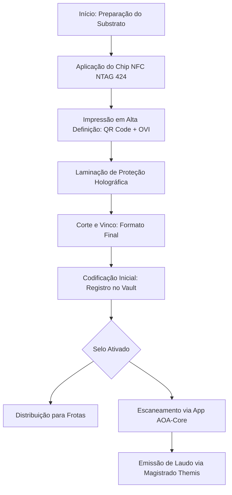

# 🏷️ Blueprint Técnico: Montagem do Selo GuardTag V1
**Status:** `READY FOR PROTOTYPING — CONFIDENTIAL`

Este documento consolida as especificações de materiais, arquitetura de camadas e o fluxo de montagem técnica para o hardware de borda **GuardTag**. Esta infraestrutura é a base física para a validação forense do **Magistrado Themis**.

---

## 1. Evolução do Design (V2.1 vs Blueprint V1)

| Especificação GuardTag V2.1 | Blueprint Técnico de Montagem (V1) |
| :--- | :--- |
|  |  |

---

## 2. Detalhamento de Camadas (The 7-Layer Stack)

| Ordem | Componente | Especificação Técnica | Função de Defesa |
| :--- | :--- | :--- | :--- |
| **01** | **Base Adesiva** | Filme PET Tamper-Evident (VOID) | Proteção contra remoção e reutilização. |
| **02** | **Substrato** | Papel de Alta Gramatura com Fibras UV | Base para o *Optical Fingerprint* (OFP). |
| **03** | **Digital Core** | Chip NXP NTAG 424 DNA (Cilíndrico) | Autenticação Criptográfica (Camada L1). |
| **04** | **Interface** | QR Code Dinâmico (Print 1200 DPI) | Auditoria rápida e link para o Magistrado. |
| **05** | **Segurança Óptica** | Tinta OVI (Optical Variable Ink) | Defesa contra xerox e fotos (Camada L7). |
| **06** | **Top Shield** | Laminação Holográfica de Difração | Caos óptico controlado para análise de IA. |
| **07** | **Active Seal** | Assinatura IR (Infravermelho) | Defesa contra Jammers e luz visível. |

---

## 3. Diagrama de Fluxo de Montagem

---

## 4. Requisitos para Prototipagem Imediata (GATE 1)

Para o sucesso do **Active Learning Loop**, os primeiros 100 protótipos devem seguir:
- **Calibração de Cor:** Perfil CMYK puro para manter a integridade da Tinta OVI.
- **Espaçamento de Chip:** Centralização milimétrica do NFC para evitar sombras na captura óptica do QR Code.
- **Registro de Snapshot:** Cada selo deve ter sua "foto de nascimento" (Master OFP) salva no SEED#2 antes do deploy.

---
*Documento gerado por Antigravity (AI Architect) para th3m1s-core.*
